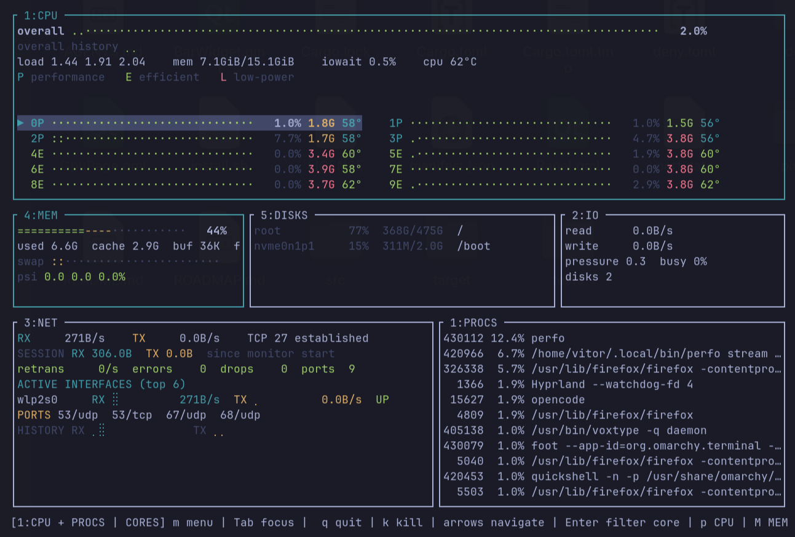

# Perfo

Perfo is a Linux system performance monitor written in Rust. It can run as an
interactive terminal application or as the data engine behind an Omarchy
Quickshell plugin.

The Rust binary owns collection and calculations. The Omarchy files are only a
thin presentation layer. On a machine without Omarchy, the terminal TUI and
the JSON commands remain usable.



## Features

- Interactive CPU-focused TUI.
- CPU, per-core usage, load, memory, swap, pressure, disk I/O and network data.
- Process list with short process names and full command lines in the TUI.
- Read-only fan RPM and temperature discovery through Linux hwmon.
- Optional GPU data when the kernel exposes a supported interface.
- JSON snapshots for scripts, bars and other widgets.
- Built-in syscall tracing with `ptrace`; no `strace` dependency.

## Release Scope

This release intentionally uses a small set of audited Rust crates instead of
reimplementing every terminal, system-information, and JSON primitive. The
current direct dependencies are `crossterm`, `libc`, `ratatui`, `serde`,
`serde_json`, and `sysinfo`.

The project reads Linux procfs and sysfs directly where that gives a clear
kernel contract. A future release may replace more of `sysinfo` and eventually
parts of the TUI, but the current release is not presented as zero-dependency.
Supply-chain checks and their current status are documented in
[`docs/architecture.md`](docs/architecture.md).

GitHub automation in [`.github/workflows/dependencies.yml`](.github/workflows/dependencies.yml)
publishes the direct dependency tree and duplicate-version report in the
workflow summary and reviews changed dependencies on pull requests. The
dedicated [security workflow](.github/workflows/security.yml) runs `cargo audit`
and `cargo deny check` without duplicating that work.

## Run In The Terminal

```bash
perfo
```

Useful non-interactive commands:

```bash
perfo --help
perfo --version
perfo cpu --json
perfo stream --json
perfo bench 15
```

`perfo cpu --json` emits one complete snapshot. `perfo stream --json` emits one
JSON object per line and flushes after every sample, so it can be consumed by
`jq`, a shell script or another widget:

```bash
perfo stream --json | jq '{cpu: .overall_percent, memory: .mem, fans: .fans}'
```

The TUI opens with no arguments or with `perfo tui`. Use the keyboard help
inside the application for navigation and the available focused views.

## Process Tracing

Trace a command launched by Perfo:

```bash
perfo trace -- command argument
```

Trace an existing process when Linux permissions allow it:

```bash
perfo trace PID
perfo trace PID syscall-name
```

Tracing an existing process is normally limited by the kernel Yama policy and
process ownership. Starting the command through `perfo trace --` is the most
portable option and does not require changing global ptrace policy.

## Omarchy Plugin

The repository root is the installable `vitor.perfo` Omarchy plugin. The binary
is compiled by GitHub Actions and committed into the repository so every release
is self-contained:

```bash
omarchy plugin add https://github.com/VitorHolandaI/perfo.git --enable
```

The plugin auto-detects its binary location inside the cloned plugin tree. No
separate binary install or `PERFO_BIN` variable is needed when installed through
`omarchy plugin add`.

For local development, install the binary first, then test the plugin from the
working tree:

```bash
cargo build --release
mkdir -p "$HOME/.config/omarchy/plugins/vitor.perfo"
cp -- *.qml manifest.json bin/perfo "$HOME/.config/omarchy/plugins/vitor.perfo/"
omarchy plugin enable vitor.perfo right
omarchy restart shell
```

Set `PERFO_BIN` before restarting the shell when the binary is somewhere else:

```bash
export PERFO_BIN="$HOME/bin/perfo"
omarchy restart shell
```

Installations made with `omarchy plugin add` can be removed safely with:

```bash
omarchy plugin disable vitor.perfo
omarchy plugin remove vitor.perfo --yes
```

The plugin needs no elevated privileges, does not overwrite shell configuration,
and is licensed under MIT. Its monitor runtime dependency is the `perfo` binary,
which ships inside the plugin tree.

### Plugin Dependencies

- Omarchy shell with Quickshell and its standard `qs.*` modules.
- The `perfo` Linux x86_64 binary, embedded in the plugin tree
  (`bin/perfo`).
- Linux `/proc` and `/sys` interfaces for system and process metrics; no
  separate `lm_sensors` package or daemon is required.
- Optional NVIDIA driver NVML library (`libnvidia-ml.so.1` or
  `libnvidia-ml.so`) for NVIDIA utilization, VRAM, temperature, power, and
  process metrics. Intel and AMD support uses kernel DRM/sysfs interfaces.

The Rust crates listed in `Release Scope` are build-time dependencies compiled
into the `perfo` binary. Plugin users do not install those crates separately.

For the marketplace, an optional root-level `preview.png` (also `jpg`, `jpeg`,
`webp`, or `avif`) is used as the listing preview. Additional screenshots can
be stored under `docs/images/` and linked from this README; they are not
attached through the submission form.

## Data Sources

Perfo reads standard Linux interfaces before using a syscall:

- `/proc/stat`, `/proc/meminfo`, `/proc/net` and `/proc/<pid>` for CPU,
  memory, network and process data.
- `/sys/class/hwmon` for fan RPM and sensor values.
- `/sys/class/drm` and driver sysfs files for supported GPU values.
- DRM fdinfo engine times for Intel i915 utilization.
- dynamically loaded NVML for NVIDIA utilization, VRAM, temperature, and power.

The monitor is read-only. It does not write PWM or EC files, load kernel
modules, install daemons or require `lm_sensors`.

Unavailable hardware values remain unavailable. A real stopped fan may report
`0 RPM`; that is different from a sensor that does not exist or cannot be read.

Detailed page formulas and display behavior are documented in
[`docs/ui-pages.md`](docs/ui-pages.md). Hardware and implementation references
are indexed in [`docs/README.md`](docs/README.md).

## Development

```bash
cargo fmt --check
cargo test --all-features --locked
cargo clippy --all-targets --all-features --locked -- -D warnings
```

Build an optimized binary without installing it:

```bash
cargo build --release
```

The output is `target/release/perfo`.

## License

MIT. See [`Cargo.toml`](Cargo.toml) for package metadata.
