# Perfo

Perfo is a Linux system performance monitor written in Rust. It can run as an
interactive terminal application or as the data engine behind an Omarchy
Quickshell plugin.

The Rust binary owns collection and calculations. The Omarchy files are only a
thin presentation layer. On a machine without Omarchy, the terminal TUI and
the JSON commands remain usable.

> **Repository Architecture**:
> - **Source Code and Development (this repo)**: [VitorHolandaI/perfo-src](https://github.com/VitorHolandaI/perfo-src) (Rust engine, CLI, tests, build workflows, documentation, standalone installer)
> - **Omarchy Runtime Distribution**: [VitorHolandaI/perfo](https://github.com/VitorHolandaI/perfo) (clean runtime package consumed by `omarchy plugin add`)
> - **Marketplace Listing**: [omarchyplugins.com/plugin.html?id=vitor.perfo](https://omarchyplugins.com/plugin.html?id=vitor.perfo)


## Features

- Interactive CPU-focused TUI with 7 dedicated full-screen panes (CPU, IO, NET, MEM, Disks, GPU, History).
- Omarchy Quickshell widget with 9 dynamic pages and status bar popout.
- Historical flight recorder with real-time metric timeline graphs (CPU, MEM, IO, NET, GPU).
- Session recording with custom duration presets (30s, 2m, 5m, 15m, 30m, 1h, custom minutes).
- Interactive replay scrubber with step, jump, play/pause, and return to live stream.
- Saved sessions manager modal to inspect, load, and delete recorded flight sessions.
- Process-level network socket monitoring via Netlink TCP diagnostics (RX/TX bytes and transfer rates).
- CPU, per-core usage, load, memory, swap, pressure (PSI), disk I/O and network throughput.
- Process list with short process names, full command lines, tree view, and live sorting in the TUI.
- Read-only fan RPM and temperature discovery through Linux hwmon.
- Optional GPU data (Intel DRM fdinfo, NVIDIA NVML, AMD sysfs) when available.
- Native Intel NPU utilization, frequency, and allocated memory from `intel_vpu` sysfs; no `intel-npu-smi` or root access required.
- High-performance JSON stream (`perfo stream --json`) and snapshot (`perfo cpu --json`) for external scripts.
- Built-in syscall tracing with `ptrace`; no `strace` dependency.

## Release Scope

This release intentionally uses a small set of audited Rust crates instead of
reimplementing every terminal, system-information, and JSON primitive. The
current direct dependencies are `crossterm`, `libc`, `ratatui`, `serde`,
`serde_json`, and `sysinfo`.

The project reads Linux procfs and sysfs directly where that gives a clear
kernel contract. A future release may replace more of `sysinfo` and eventually
parts of the TUI, but the current release is not presented as zero-dependency.
Supply-chain checks and their current status are documented in
[`docs/architecture.md`](docs/architecture.md).

GitHub automation in [`.github/workflows/dependencies.yml`](.github/workflows/dependencies.yml)
publishes the direct dependency tree and duplicate-version report in the
workflow summary and reviews changed dependencies on pull requests. The
dedicated [security workflow](.github/workflows/security.yml) runs `cargo audit`
and `cargo deny check` without duplicating that work.

## Installation

### Standalone Linux (Non-Omarchy)

To install the pre-compiled `perfo` binary into `~/.local/bin` without needing Rust or Omarchy:

```bash
curl -sSL https://raw.githubusercontent.com/VitorHolandaI/perfo-src/main/install.sh | bash
```

Custom installation directory (default is `~/.local/bin`):

```bash
curl -sSL https://raw.githubusercontent.com/VitorHolandaI/perfo-src/main/install.sh | PERFO_INSTALL_DIR=/usr/local/bin bash
```

Or build and install locally from source using the installer script:

```bash
./install.sh --build
```

### Omarchy Plugin

For Omarchy users, install the distribution package via the Omarchy plugin CLI:

```bash
omarchy plugin add https://github.com/VitorHolandaI/perfo.git --enable
```

## Run In The Terminal

```bash
perfo
```

Useful non-interactive commands:

```bash
perfo --help
perfo --version
perfo cpu --json
perfo stream --json
perfo bench 15
```

`perfo cpu --json` emits one complete snapshot. `perfo stream --json` emits one
JSON object per line and flushes after every sample, so it can be consumed by
`jq`, a shell script or another widget:

```bash
perfo stream --json | jq '{cpu: .overall_percent, memory: .mem, fans: .fans}'
```

The TUI opens with no arguments or with `perfo tui`. Use the keyboard help
inside the application for navigation and the available focused views.

## Process Tracing

Trace a command launched by Perfo:

```bash
perfo trace -- command argument
```

Trace an existing process when Linux permissions allow it:

```bash
perfo trace PID
perfo trace PID syscall-name
```

Tracing an existing process is normally limited by the kernel Yama policy and
process ownership. Starting the command through `perfo trace --` is the most
portable option and does not require changing global ptrace policy.

## Omarchy Plugin Integration

The pre-packaged runtime plugin is distributed via [VitorHolandaI/perfo](https://github.com/VitorHolandaI/perfo).
The binary is pre-compiled and committed into the distribution tree so every release
is self-contained:

```bash
omarchy plugin add https://github.com/VitorHolandaI/perfo.git --enable
```

The plugin auto-detects its binary location inside the cloned plugin tree. No
separate binary install or `PERFO_BIN` variable is needed when installed through
`omarchy plugin add`.

For local development or testing with the Omarchy shell:

```bash
cargo build --release
mkdir -p "$HOME/.config/omarchy/plugins/vitor.perfo"
cp -- *.qml manifest.json target/release/perfo "$HOME/.config/omarchy/plugins/vitor.perfo/"
omarchy plugin enable vitor.perfo right
omarchy restart shell
```

Set `PERFO_BIN` before restarting the shell when the binary is somewhere else:

```bash
export PERFO_BIN="$HOME/bin/perfo"
omarchy restart shell
```

Installations made with `omarchy plugin add` can be removed safely with:

```bash
omarchy plugin disable vitor.perfo
omarchy plugin remove vitor.perfo --yes
```

The plugin needs no elevated privileges, does not overwrite shell configuration,
and is licensed under MIT. Its monitor runtime dependency is the `perfo` binary,
which ships inside the plugin tree.

### Plugin Dependencies

- Omarchy shell with Quickshell and its standard `qs.*` modules.
- The `perfo` Linux x86_64 binary, embedded in the plugin tree
  (`bin/perfo`).
- Linux `/proc` and `/sys` interfaces for system and process metrics; no
  separate `lm_sensors` package or daemon is required.
- Optional NVIDIA driver NVML library (`libnvidia-ml.so.1` or
  `libnvidia-ml.so`) for NVIDIA utilization, VRAM, temperature, power, and
  process metrics. Intel and AMD support uses kernel DRM/sysfs interfaces.

The Rust crates listed in `Release Scope` are build-time dependencies compiled
into the `perfo` binary. Plugin users do not install those crates separately.

For the marketplace, an optional root-level `preview.png` (also `jpg`, `jpeg`,
`webp`, or `avif`) is used as the listing preview. Additional screenshots can
be stored under `docs/images/` and linked from this README; they are not
attached through the submission form.

## Screenshots & Interface Gallery

### Quickshell Widget (Desktop Views)

The Omarchy widget integrates into the desktop shell with specialized views, real-time sparklines, and a compact status bar popout:

| Page | View | Description |
| :--- | :--- | :--- |
| **1** | **[Dashboard](docs/images/widgetpage1.png)** | System overview: aggregate CPU, memory, load averages, per-core bars, and top processes |
| **2** | **[Disk I/O](docs/images/widgetpage2.png)** | Real-time read and write throughput sparklines, active storage devices, and I/O processes |
| **3** | **[Network](docs/images/widgetpage3.png)** | Interface throughput (RX/TX), active network interfaces, and socket activity |
| **4** | **[Memory](docs/images/widgetpage4.png)** | Physical RAM usage, swap space, PSI memory pressure, and top memory consumers |
| **5** | **[Filesystems](docs/images/widgetpage5.png)** | Mounted disk partitions, mount points, used/free space, and capacity warnings |
| **6** | **[GPU / NPU](docs/images/widgetpage6.png)** | GPU engine utilization, VRAM, temperature, per-process GPU compute, and Intel NPU utilization, frequency, and memory |
| **7** | **[Syscall Tracer](docs/images/widgetpage7.png)** | Real-time ptrace syscall event logger for any running PID or spawned command |
| **8** | **[Hardware Fans](docs/images/widgetpage8.png)** | Cooling fan RPMs and CPU/chassis temperature sensors discovered via hwmon |
| **9** | **[Flight Recorder](docs/images/widgetpage9.png)** | Historical metric timeline, session recording, replay scrubber, and sessions modal |

#### Page 1: Dashboard (`Dash`)
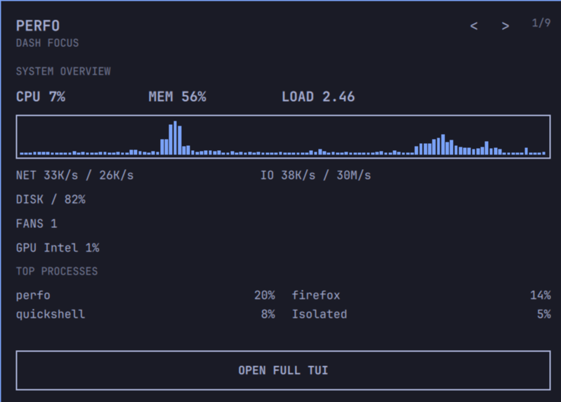

#### Page 2: Disk I/O (`IO`)
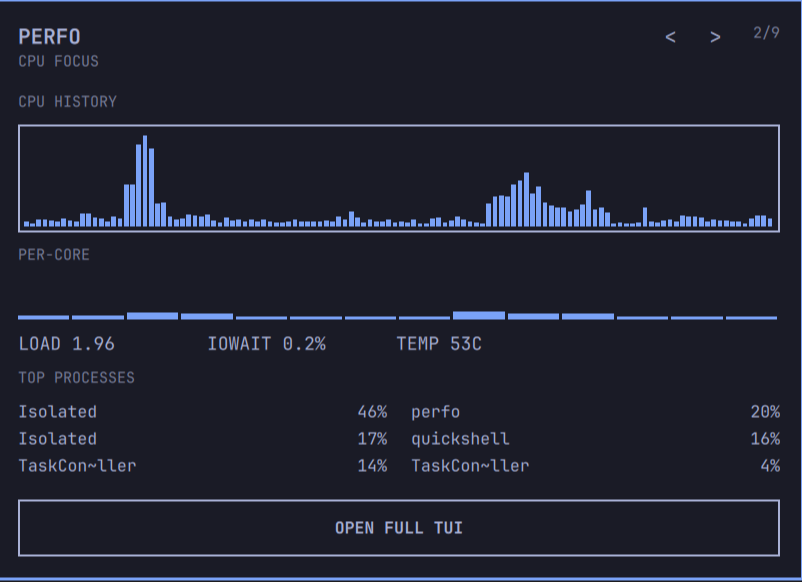

#### Page 3: Network Throughput (`NET`)
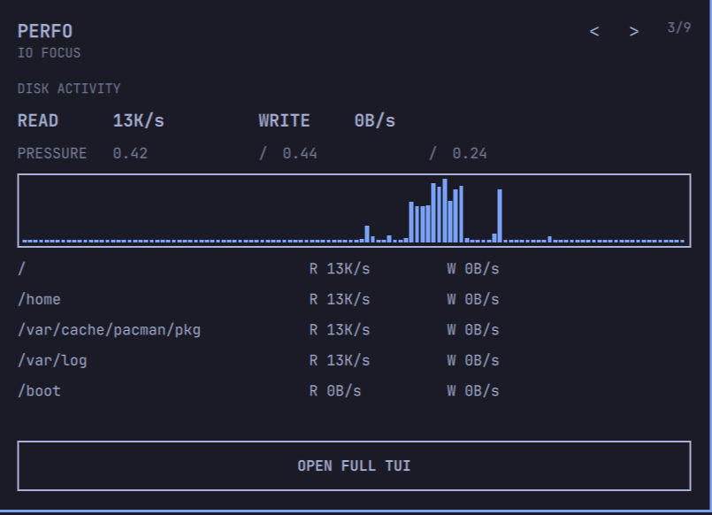

#### Page 4: Memory & Swap (`MEM`)
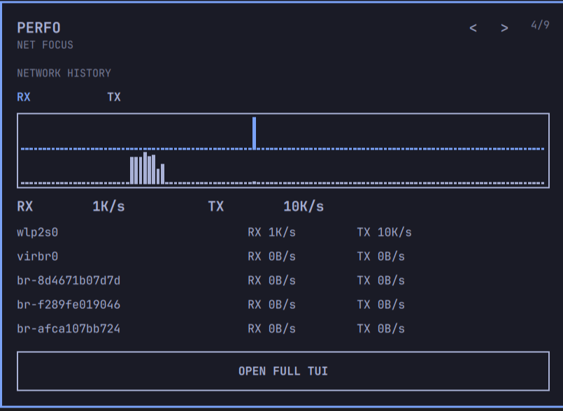

#### Page 5: Storage Filesystems (`Disks`)
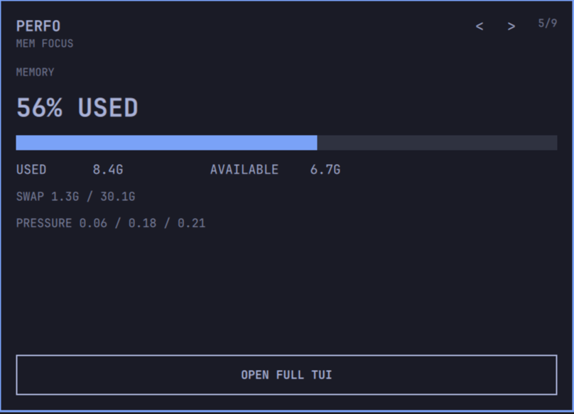

#### Page 6: GPU and NPU Acceleration (`GPU`)
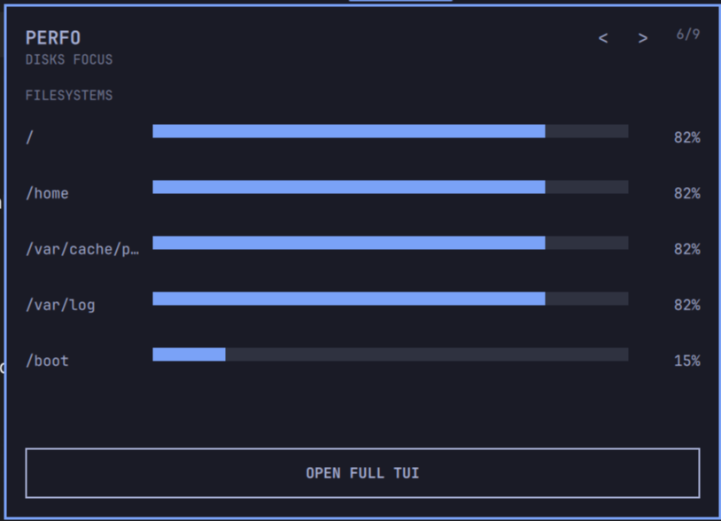

#### Page 7: Syscall Tracer (`Trace`)
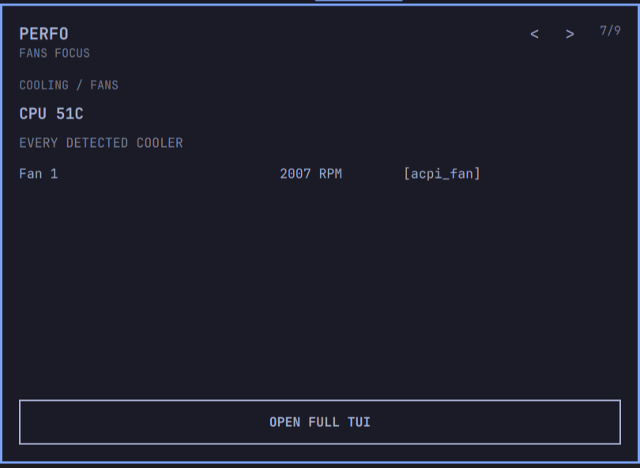

#### Page 8: Hardware Fans & Thermals (`Fans`)
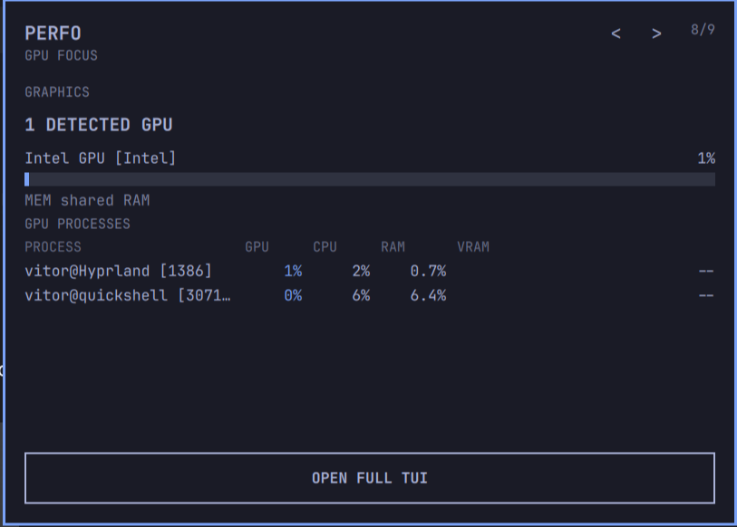

#### Page 9: History & Flight Replay (`Hist`)
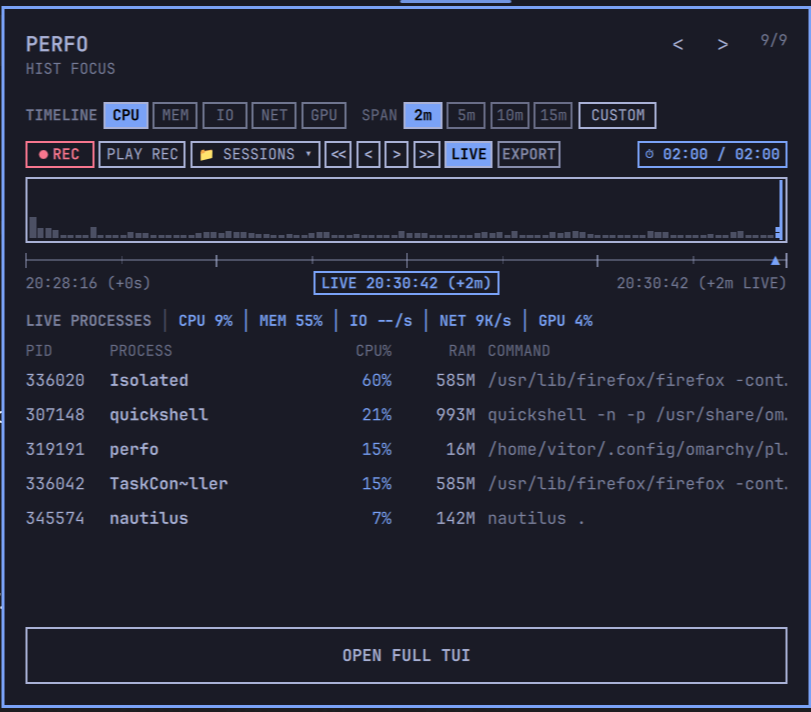

---

### Terminal TUI (Console Views)

The standalone terminal interface (`perfo` or `perfo tui`) provides zero-latency monitoring with hotkeys (`1-7`, `Tab`, `h/l`):

| Pane | View | Description |
| :--- | :--- | :--- |
| **1** | **[CPU Dashboard](docs/images/terminalpage1.png)** | Per-core utilization bars, CPU frequency, load average, uptime, and process tree |
| **2** | **[Disk I/O](docs/images/terminalpage2.png)** | Device throughput, read/write rates, and top disk I/O processes |
| **3** | **[Network](docs/images/terminalpage3.png)** | Interface bandwidth, Netlink socket byte tracking, connections, and per-process RX/TX |
| **4** | **[Memory](docs/images/terminalpage4.png)** | RAM breakdown (used, free, buffers, cached), swap, and memory consumers |
| **5** | **[Storage Mounts](docs/images/terminalpage5.png)** | Partition sizes, available space, filesystem types, and mount points |
| **6** | **[GPU / NPU Monitor](docs/images/terminalpage6.png)** | GPU load, memory, temperature, power, process compute, and Intel NPU utilization and frequency |
| **7** | **[History Analysis](docs/images/terminalpage7.png)** | Timeline graphs, recording (`r`), sessions modal (`s`), stepping, and flight replay |

#### Pane 1: CPU Dashboard (`1:CPU`)
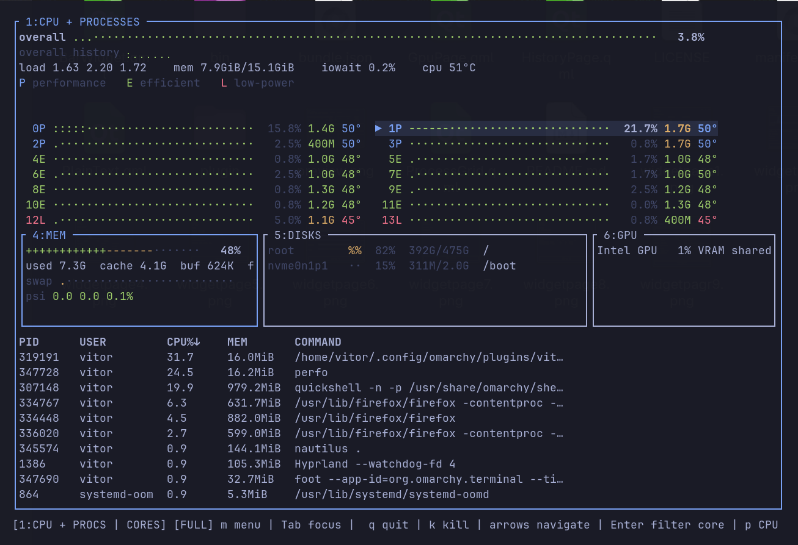

#### Pane 2: Disk I/O Activity (`2:IO`)
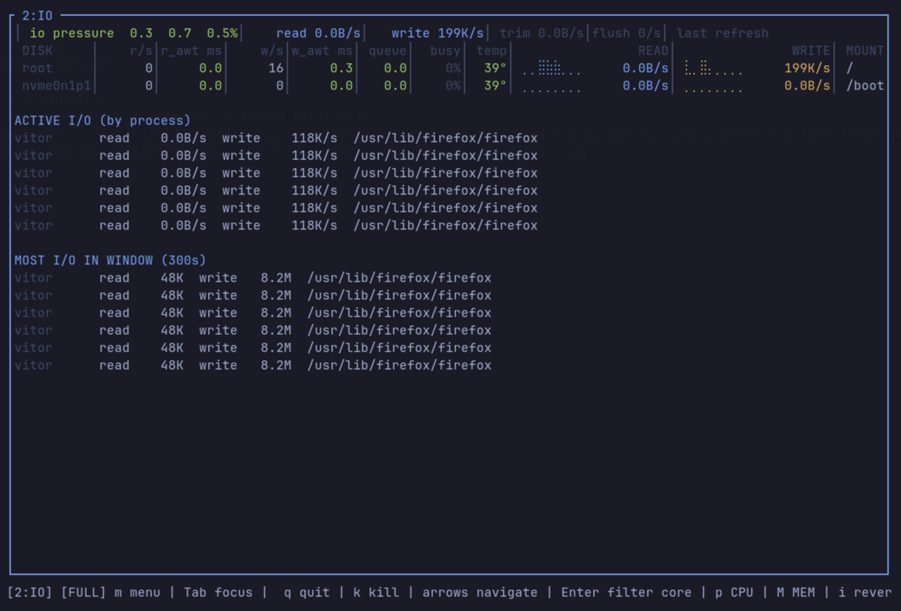

#### Pane 3: Network Bandwidth & Sockets (`3:NET`)
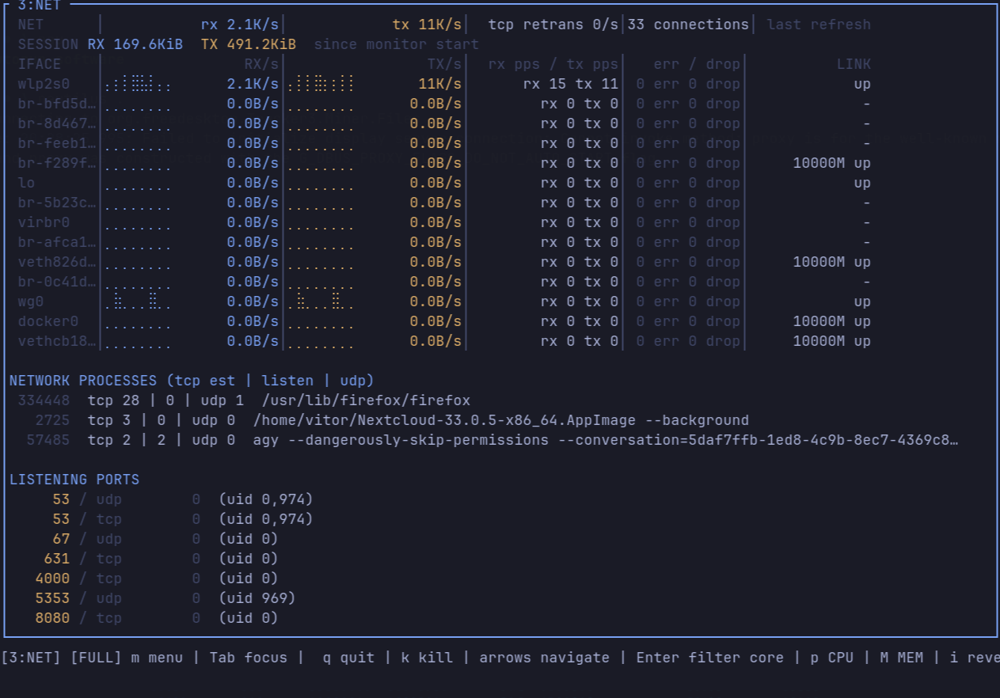

#### Pane 4: Memory & Swap Hierarchy (`4:MEM`)
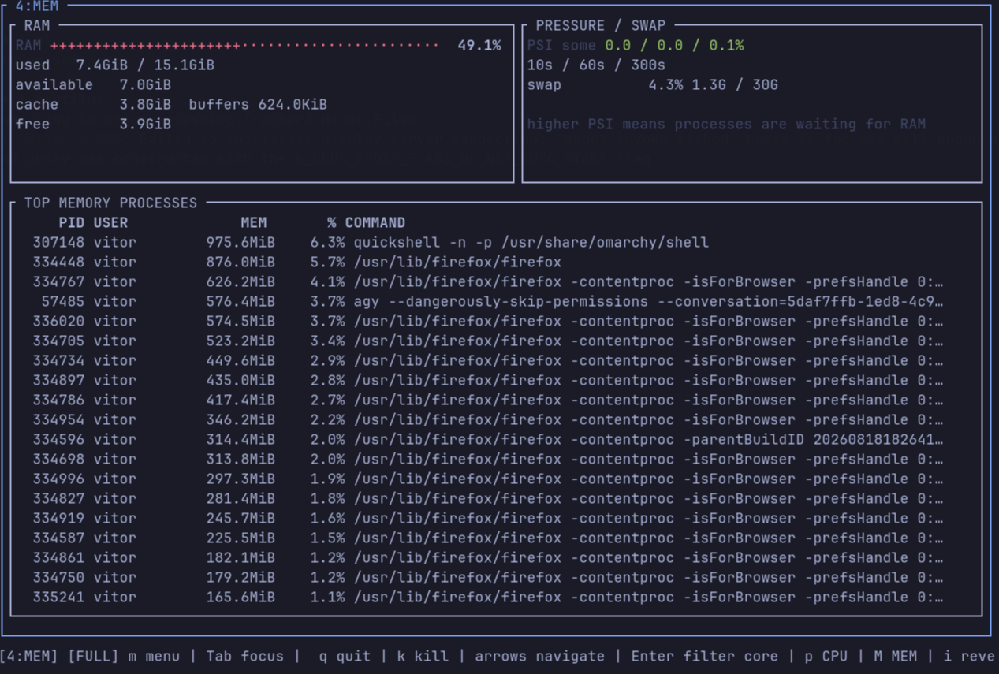

#### Pane 5: Filesystems & Mounts (`5:Disks`)
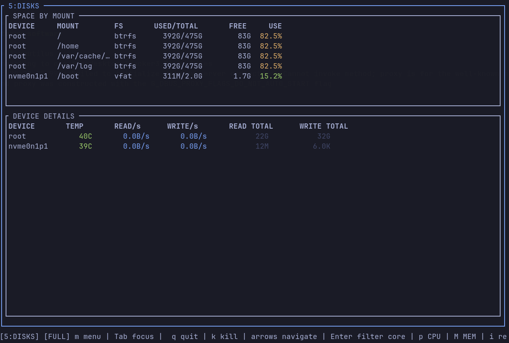

#### Pane 6: GPU and NPU Acceleration (`6:GPU / NPU`)
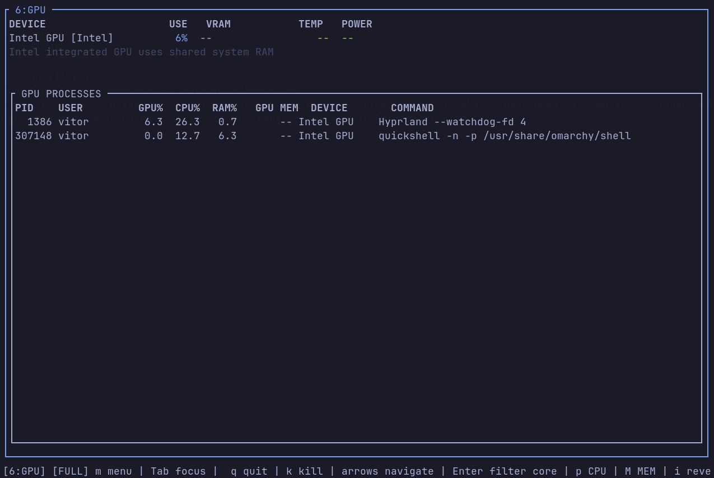

#### Pane 7: History Analysis & Replay Scrubber (`7:Hist`)
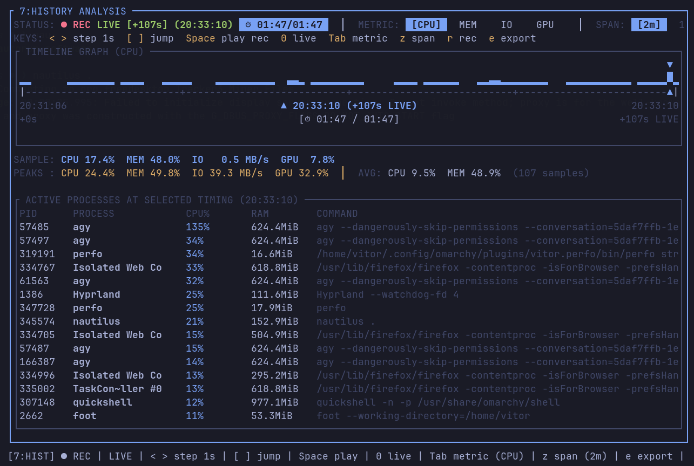

## Data Sources

Perfo reads standard Linux interfaces before using a syscall:

- `/proc/stat`, `/proc/meminfo`, `/proc/net` and `/proc/<pid>` for CPU,
  memory, network and process data.
- `/sys/class/hwmon` for fan RPM and sensor values.
- `/sys/class/drm` and driver sysfs files for supported GPU values.
- `/sys/class/accel/accel*/device` for Intel NPU busy time, frequency, and allocated memory.
- DRM fdinfo engine times for Intel i915 utilization.
- dynamically loaded NVML for NVIDIA utilization, VRAM, temperature, and power.

The monitor is read-only. It does not write PWM or EC files, load kernel
modules, install daemons, require `lm_sensors`, or execute `intel-npu-smi`.

Unavailable hardware values remain unavailable. A real stopped fan may report
`0 RPM`; that is different from a sensor that does not exist or cannot be read.

Detailed page formulas and display behavior are documented in
[`docs/ui-pages.md`](docs/ui-pages.md). Hardware and implementation references
are indexed in [`docs/README.md`](docs/README.md).

## Development

```bash
cargo fmt --check
cargo test --all-features --locked
cargo clippy --all-targets --all-features --locked -- -D warnings
```

Build an optimized binary without installing it:

```bash
cargo build --release
```

The output is `target/release/perfo`.

## License

MIT. See [`Cargo.toml`](Cargo.toml) for package metadata.
